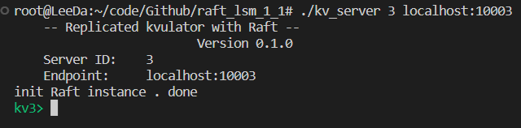
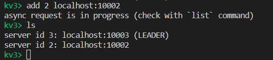
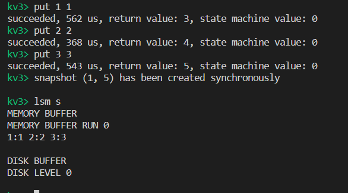

<!-- # [](https://travis-ci.org/baidu/braft) -->

---

# Overview
该项目是一个实现LSM-Tree存储结构和Raft协议的分布式存储系统。LSM-Tree是一种高度优化的存储结构，它通过将随机访问和顺序访问相结合，提高了读写性能。而Raft协议是一种易于理解的分布式一致性算法，它可以保证系统在异常故障或网络不稳定的情况下仍然能够保持一致性。

本项目中，使用LSM-Tree作为raft中日志的存储引擎。

# Getting Started

* 首先下载[nuraft库](https://github.com/eBay/NuRaft)，并根据提示进行编译、安装。nuraft库是ebay基于raft论文原理实现的分布式架构。

* 安装nuraft成功后，进行编译即可

    ```shell 
    g++ -o kv_server kv_server.cxx raft/in_memory_log_store.cxx raft/logger.cc -lnuraft -lssl -lpthread
    ```
* 例子
    - 启动一个server(server_id:3)

        - 参数格式：**【server_id】【address：port】**
        ```shell
        ./kv_server 3 localhost:10003
        ```
        
    - 将一个新的server（server_id:2）加入到server_id为3的集群中
        - 指令格式：**add 【server_id】【localhost:10002】**
            ```shell
            add 2 localhost:10002
            ```
        - 查看集群中的各个节点
            ```shell
            ls
            ```
            
    - 添加新值
        - 指令格式：**put key value**
            ```shell
            put 1 1
            ```
    - 查看lsm-tree
        - 指令格式：lsm 【选项】
            - s：输出lsm-tree的存储结构
            - g：输入一个key值，进行查询
            - r：再输入两个端点key值，进行范围搜索
            ```shell
            lsm s
            lsm g 1
            lsm r 1 3
            ```
            

# Docs

* nuraft中源码的注释理解 https://blog.csdn.net/weixin_43623525?type=blog
* raft论文 https://github.com/maemual/raft-zh_cn

# Discussion

* 